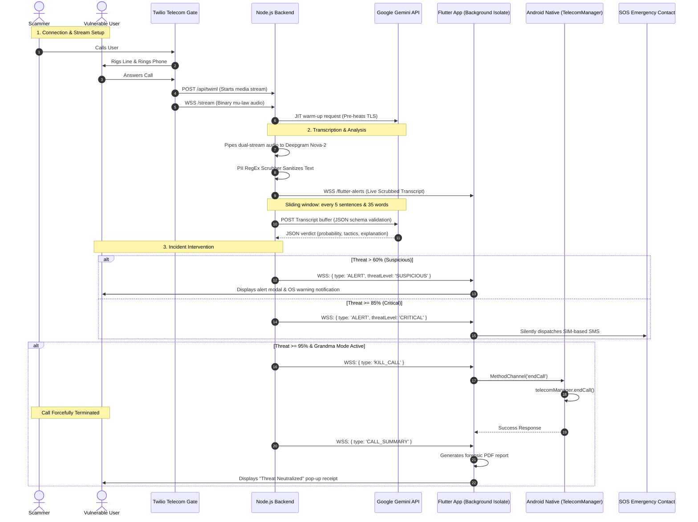

# 🛡️ CallShield AI: System Blueprint & Architecture Manual

This document provides a comprehensive, production-grade guide to the **CallShield AI** system architecture, data flows, communication protocols, and engineering constraints. It serves as a developer blueprint and a reference manual for both human developers and agentic AI systems working on this codebase.

---

## 📌 1. System Vision & Core Mission

CallShield AI is a real-time, privacy-first voice firewall designed to detect social engineering, impersonation, and "Digital Arrest" scams. 

Traditional anti-spam telecom databases (like Truecaller) only alert the user *before* answering a call. If a vulnerable user is intimidated by an aggressive scammer threatening arrest, simple alert banners are ineffective. CallShield AI operates as an **active digital bodyguard** that:
1. **Intercepts** dual-channel voice audio of live calls.
2. **Scrub PII** locally to maintain user privacy (Zero-Knowledge pipeline).
3. **Analyzes** psychological pressure tactics in real-time.
4. **Intervene** autonomously by dropping the cellular connection ("Grandma Mode") and dispatching emergency SOS SMS alerts to trusted contacts.

---

## 🏗️ 2. Core Architecture & Data Pipeline

The application features a hybrid architecture split between a **Node.js (Express/WebSockets) backend** and a **Flutter (Kotlin-bridged) Android client**. 

### High-Level Interaction Flow


---

## 📡 3. Communication Protocols & Payload Schemas

All communication between the Flutter app and the Node.js backend happens over WebSockets via `wss://<SERVER_URL>/flutter-alerts`.

### 3.1 Client-to-Server Actions
Sent by the Flutter background isolate to initialize state or toggle server states.

#### Action: `register_sos`
Sends the user's name and configured emergency contact numbers to hold in session RAM (stateless database design).
```json
{
  "action": "register_sos",
  "userName": "Jane Doe",
  "contacts": ["+919876543210"]
}
```

#### Action: `ping`
Heartbeat signal sent every 5 seconds to keep the socket alive and detect half-open TCP connections.
```json
{ "action": "ping" }
```

#### Action: `pause_monitoring` / `resume_monitoring`
Informs the server whether to ignore incoming Twilio media streams or actively scan them.
```json
{ "action": "pause_monitoring" }
```

---

### 3.2 Server-to-Client Broadcasts
Pushed down to the Flutter client from `server.js`.

#### Event: `TRANSCRIPT`
Sends live, real-time transcribed chunks to update the Live Radar screen.
```json
{
  "type": "TRANSCRIPT",
  "role": "inbound", 
  "text": "Hello, I am calling from FedEx customs regarding an illegal package."
}
```
*Note: `role` can be either `"inbound"` (scammer/caller) or `"outbound"` (user).*

#### Event: `ALERT`
Sent when the scam probability exceeds 60%.
```json
{
  "type": "ALERT",
  "threatLevel": "CRITICAL", // "SUSPICIOUS" or "CRITICAL"
  "probability": 89,
  "tactics": ["Impersonation", "Urgency"],
  "explanation": "Caller claims to be a government official threatening immediate arrest unless funds are transferred.",
  "dispatch_time": 1774020102000
}
```

#### Event: `KILL_CALL`
Sent when threat probability meets or exceeds 95%.
```json
{
  "type": "KILL_CALL",
  "probability": 98
}
```

#### Event: `CALL_SUMMARY`
Dispatched when the Twilio call drops. Triggers the generation of the forensic report.
```json
{
  "type": "CALL_SUMMARY",
  "callerId": "+919876543210",
  "maxThreat": 98,
  "tactics": ["Impersonation", "Urgency", "Coercion"],
  "transcript": "[INBOUND]: Hello, I am calling from CBI...\n[OUTBOUND]: Yes, what happened?...\n"
}
```

---

## 🛠️ 4. Subsystem Implementations

### 4.1 Zero-Knowledge Privacy Scrubber
To prevent exposing sensitive data to cloud LLMs, the Node.js backend intercepts the raw transcript returned from Deepgram and redacts it via regex expressions before it is queued into Gemini:
*   **Credit/Debit Cards**: `/\b(?:\d[ -]*?){13,19}\b/g` $\rightarrow$ `[CREDIT_CARD_REDACTED]`
*   **Aadhaar Cards**: `/\b\d{4}[- ]?\d{4}[- ]?\d{4}\b/g` $\rightarrow$ `[AADHAAR_REDACTED]`
*   **SSNs**: `/\b\d{3}[- ]?\d{2}[- ]?\d{4}\b/g` $\rightarrow$ `[SSN_REDACTED]`
*   **OTPs & PINs**: `/\b\d{3,6}\b/g` $\rightarrow$ `[OTP_OR_PIN_REDACTED]`

### 4.2 LLM Scam Detection Engine
*   **Model**: `gemini-3.1-flash-lite-preview`
*   **Reason**: Chosen for sub-second latency and high request rate limits (500 RPD free tier) compared to Gemini 1.5/2.5.
*   **Prompt Architecture**: Structured JSON schema output enforced via the API:
    ```javascript
    const responseSchema = {
        type: SchemaType.OBJECT,
        properties: {
            scam_probability: { type: SchemaType.INTEGER },
            flagged_tactics: { type: SchemaType.ARRAY, items: { type: SchemaType.STRING } },
            explanation: { type: SchemaType.STRING }
        },
        required: ["scam_probability", "flagged_tactics", "explanation"]
    };
    ```

### 4.3 Native Android Call Hangup
Android blocks background processes from directly accessing call controls. To bypass this:
1.  The Flutter background isolate receives `KILL_CALL` and fires the `trigger_grandma_mode` event to the foreground UI.
2.  The UI invokes the native Kotlin `MethodChannel('com.callshield.native/telecom')` on `MainActivity.kt`.
3.  The Kotlin class checks for permissions and leverages the Android `TelecomManager` service to forcefully sever the active connection:
    ```kotlin
    private fun disconnectCall(): Boolean {
        return try {
            val telecomManager = getSystemService(Context.TELECOM_SERVICE) as TelecomManager
            if (Build.VERSION.SDK_INT >= Build.VERSION_CODES.P) {
                telecomManager.endCall() // Terminates active call
            } else false
        } catch (e: Exception) { false }
    }
    ```

### 4.4 Background SMS Sender
*   **Package**: `sms_sender_background`
*   **Reason**: Standard packages (like `telephony`) crash silently on Android 14+ due to `RECEIVER_EXPORTED` flags required by modern Google Play Store policies.
*   **Formatting Constraints**: SMS content must be strictly under 160 characters and contain **no emojis**. Emojis force the GSM modem to switch to UCS-2 encoding, reducing the character limit to 70 and causing silent packet drop failures on carrier networks.

### 4.5 Forensic Report (FIR Engine)
*   **Package**: `pdf`
*   **Operation**: Triggered silently in the background upon receiving `CALL_SUMMARY`.
*   **Artifact Path**: Documents folder (`getApplicationDocumentsDirectory()`) named `CallShield_FIR_{Timestamp}.pdf`.
*   **Content**: Generates a two-page document containing:
    1.  **AI Threat Verdict**: Risk score, timestamp, caller ID, and identified coercion tactics.
    2.  **Redacted Transcript**: The complete dual-channel transcript with masked PII data, ready to be emailed to `report@cybercrime.gov.in`.

---

## 🚫 5. Key Engineering Constraints (Do Not Violate or Revert)

> [!WARNING]
> Review these architectural rules before editing code:

*   **Do Not Use Sarvam AI for Real-time Streaming**: Sarvam AI requires base64-encoded JSON chunks which trigger rate-limit disconnects (`Code 1000`) over unstable Wi-Fi networks. Deepgram natively accepts raw `mu-law` binary buffers directly over WebSockets and must be retained.
*   **Do Not Re-enable Modals in `main.dart`**: Modal dialog rendering is restricted to `home_screen.dart` via `_isModalOpen` status state locks. Rendering alerts in multiple entry files causes stacked UI instances and crashes the Flutter application when high-frequency threat alerts stream in.
*   **Do Not Perform Sync Operations on SharedPreferences in Isolate Loops**: Because Flutter background isolates run in a separate Dart virtual machine, calls to `SharedPreferences` cache are isolated. Always execute `prefs.reload()` before fetching configuration data (like `grandma_mode` state) to ensure disk sync.
*   **Do Not Remove Gemini Just-In-Time Pings**: The backend fires an empty request (`[SYSTEM]: Network warmup ping`) to the Gemini endpoint *the millisecond the call starts*. This pre-heats the TLS handshake pipeline, reducing the analysis latency of the first sentence from 14 seconds to under 4 seconds.

---

## 🚀 6. Development & Deployment Guide

### 6.1 Backend Setup (`callshield_backend`)
1.  Install dependencies:
    ```bash
    npm install
    ```
2.  Configure `.env` in the root:
    ```env
    PORT=3000
    TWILIO_ACCOUNT_SID=your_twilio_sid
    TWILIO_AUTH_TOKEN=your_twilio_auth_token
    TWILIO_PHONE_NUMBER=your_twilio_phone_number
    DEEPGRAM_API_KEY=your_deepgram_api_key
    GEMINI_API_KEY=your_gemini_api_key
    ```
3.  Run Server:
    ```bash
    npm start
    ```
4.  Expose Server to the internet (Twilio webhook testing):
    ```bash
    ngrok http 3000
    ```

### 6.2 Frontend Setup (`callshield_app`)
1.  Initialize Dart packages:
    ```bash
    flutter pub get
    ```
2.  Update the target WebSocket connection strings inside `lib/main.dart` and `lib/services/background_service.dart` to match your ngrok server tunnel.
3.  Deploy to Android device (ensure device has SIM card and active telecom carrier plan for SMS testing).

---

## 🗺️ 7. DPDP-Compliant Production Roadmap

The current architecture represents a working MVP utilizing cloud voice gateways (Twilio) and hosted API endpoints. The transition blueprint to compile with Indian Digital Personal Data Protection (DPDP) standards:

1.  **Direct Audio Capture**: Remove Twilio WebSockets and transition to local audio loopback interfaces using Android's `CallScreeningService` and `InCallService` APIs to grab voice signals directly from the operating system.
2.  **On-Device Speech-to-Text**: Route the raw PCM audio stream through a quantized `whisper.tflite` model running locally on the device's CPU/GPU via Android NDK.
3.  **On-Device LLM Reasoning**: Pipe the sanitized transcripts into **Gemini Nano** via the Android AICore API.
4.  **Result**: 100% offline detection, zero API costs, zero cloud data leakage, and sub-second hardware kill responses.
