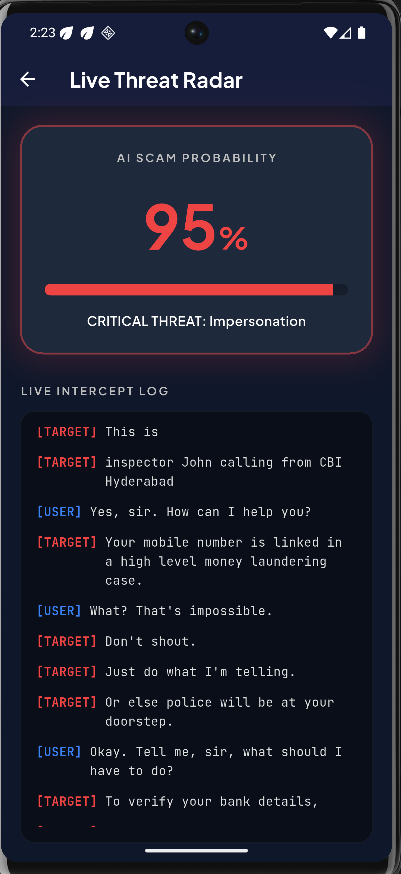
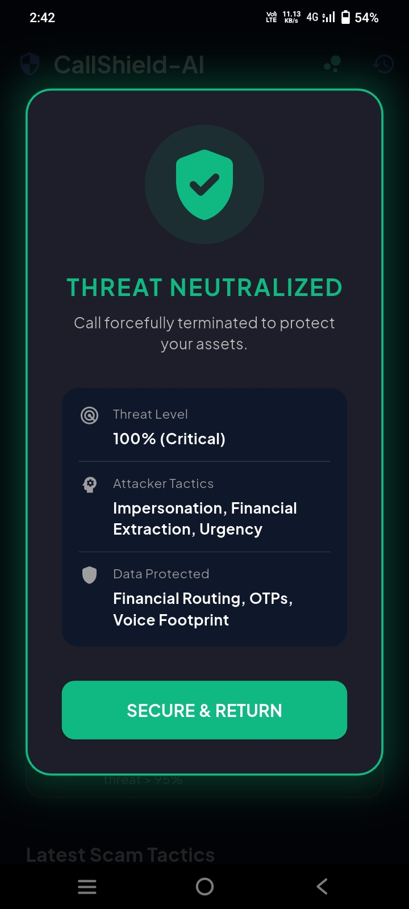
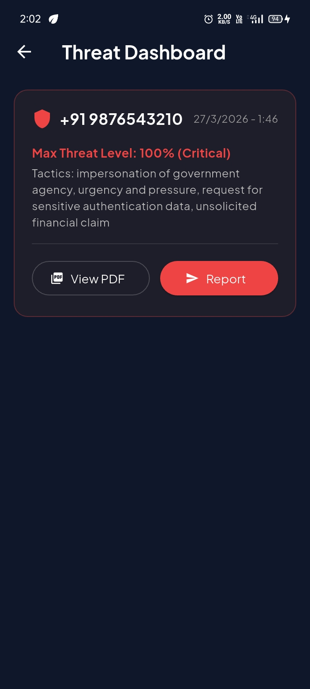

# 🛡️ CallShield AI
**An Autonomous, Real-Time Telecom Defense Grid against Social Engineering & "Digital Arrest" Scams.**

---

## 🚨 The Problem: The "Warning" Illusion
India is currently facing a massive epidemic of "Digital Arrest" and impersonation scams (fake TRAI, CBI, FedEx officials). Current telecom security apps only provide a visual "Spam" warning label *after* the call connects. But if a victim (like an elderly parent) is terrified by an aggressive scammer threatening arrest, a warning label is useless. They need physical intervention.

## 💡 The Solution: Proactive Intervention
**CallShield AI** is not a warning system; it is a proactive digital bodyguard. It intercepts cellular audio in real-time, analyzes the psychological tactics being used, and if a critical threat threshold is reached, **it forcefully severs the cellular connection without user intervention.**

---

## ⚡ Core Architecture (How it works in < 3 Seconds)
1. **Audio Interception:** Twin-channel audio is streamed via Twilio WebSockets to a custom Node.js backend.
2. **Zero-Latency Transcription:** Raw `mu-law` audio is piped into Deepgram's Nova-2 model for millisecond-level Speech-to-Text.
3. **Zero-Knowledge Privacy:** A Node.js middleware regex engine physically redacts sensitive PII (Aadhaar, Credit Cards, OTPs) from the transcript before it ever touches the AI.
4. **Cognitive Analysis:** The scrubbed transcript is fed into Google `gemini-3.1-flash-lite-preview` using a sliding window buffer to analyze social engineering tactics (Urgency, Impersonation, Coercion).
5. **OS-Level Override:** If the threat hits 95%, a `KILL_CALL` command is dispatched to the Flutter background isolate, which triggers a native Kotlin MethodChannel to forcefully terminate the Android `TelecomManager` connection.

---

## ✨ Key Features

### 👵 "Grandma Mode" (Autonomous Hangup)
When armed, CallShield AI bypasses human error. If critical financial coercion is detected, it physically drops the call and locks the scammer out, protecting vulnerable users from making fear-based mistakes.

### 🕵️ Zero-Knowledge PII Scrubber
Privacy is built into the pipeline. If a user is tricked into speaking their OTP or Bank PIN, the backend physically redacts the numbers `[OTP_OR_PIN_REDACTED]` before sending the context to the LLM. The AI evaluates the *tactics*, but never sees the *data*.

### 🚨 Emergency SOS Dispatch
Upon detecting a critical threat, the headless Flutter background service bypasses Android 14 restrictions to silently dispatch an emergency SMS to a trusted family member with the threat probability score.

### 📄 Automated Cyber Cell Reporting (FIR Engine)
Instead of just blocking the caller, CallShield fights back. It automatically compiles the Caller ID, AI Threat Verdict, and the redacted forensic transcript into a highly official PDF Incident Report. With one tap on the Threat Dashboard, it opens the user's email client, pre-filled with the National Cyber Crime Portal address and the PDF attached.

---

## 📸 Screenshots

| Live Threat Radar | "Grandma Mode" Receipt | Threat Dashboard |
|:---:|:---:|:---:|
|  |  |  |

---

## 🛠️ Tech Stack
* **Frontend:** Flutter, Dart, Kotlin (Native Method Channels)
* **Backend:** Node.js, Express, WebSockets
* **AI/ML:** Google Gemini (3.1 Flash-Lite) for Cognitive Analysis, Deepgram (Nova-2) for Audio Transcription
* **Telecom:** Twilio (Media Streams API)
* **Local DB:** SharedPreferences (Isolate-Synced)

---

## 🚀 Future Production Roadmap (DPDP Compliant)
While this MVP utilizes Deepgram and Gemini Cloud APIs for hackathon speed, our production architecture is fully mapped for strict Indian DPDP (Digital Personal Data Protection) compliance:
* **Cloud to Edge:** Transitioning off Twilio WebSockets to intercept the raw audio buffer directly via Android's `CallScreeningService` and `InCallService` APIs.
* **On-Device AI:** Processing synchronous audio through a quantized `whisper.tflite` model (via Android NDK) and feeding text to **Gemini Nano** on-device.
* **Result:** Zero internet requirement, zero cloud latency, and absolute data privacy.

---
*MOIS KHAN*